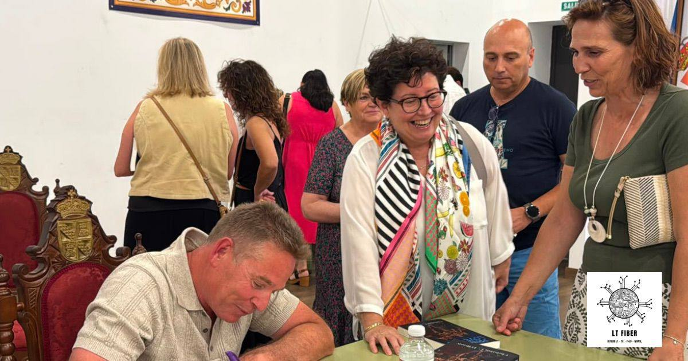
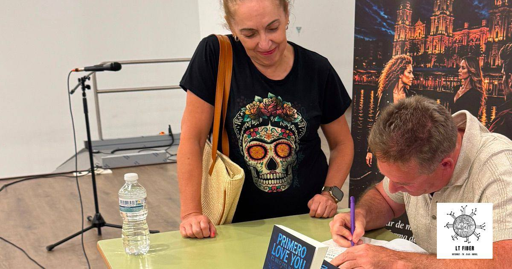
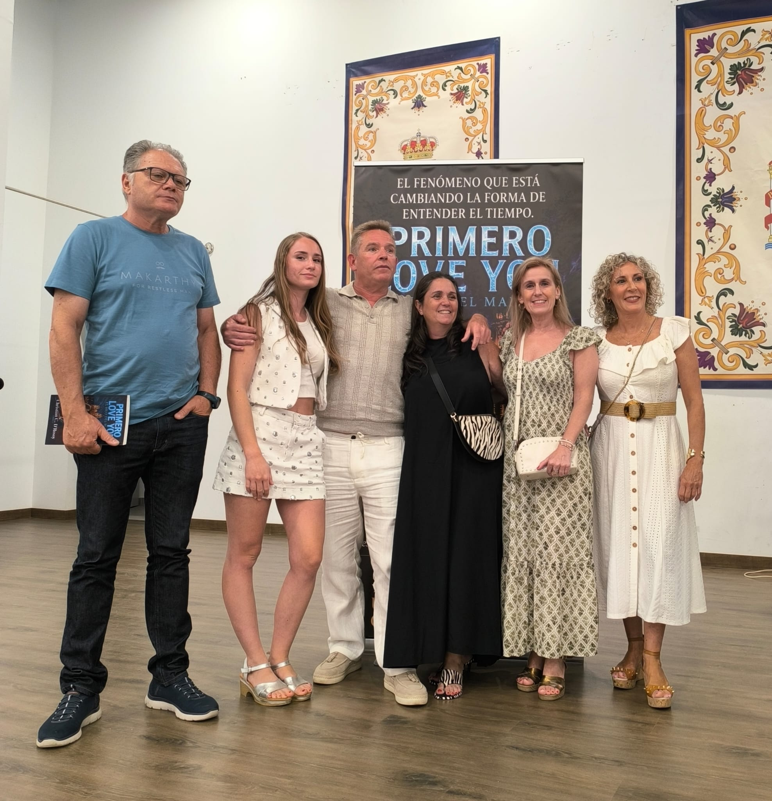
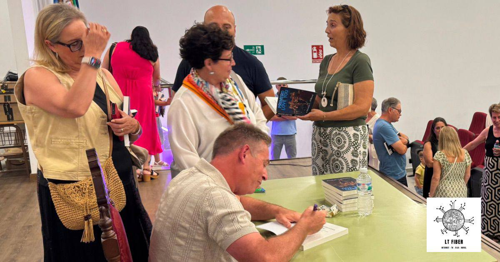
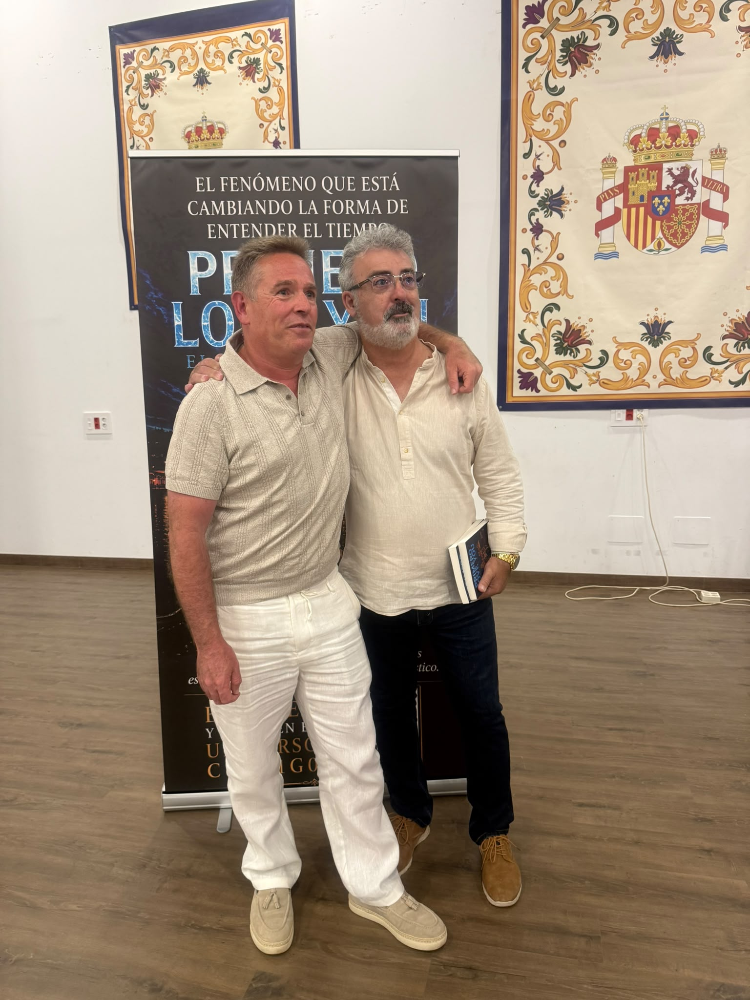
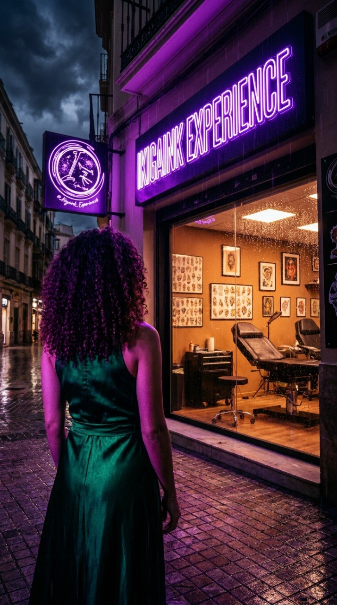
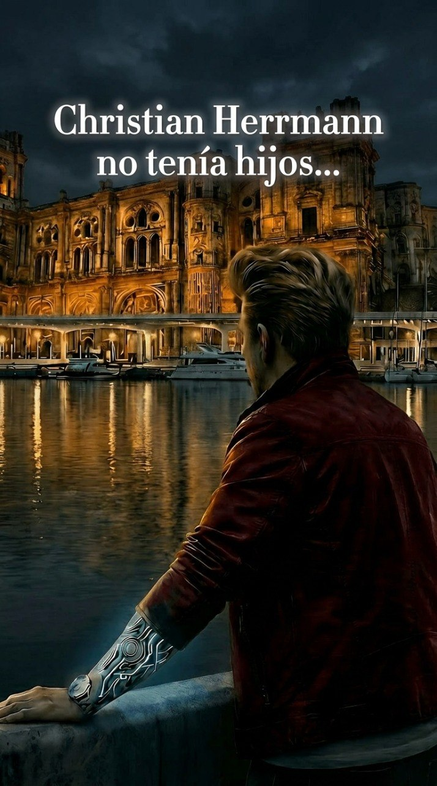
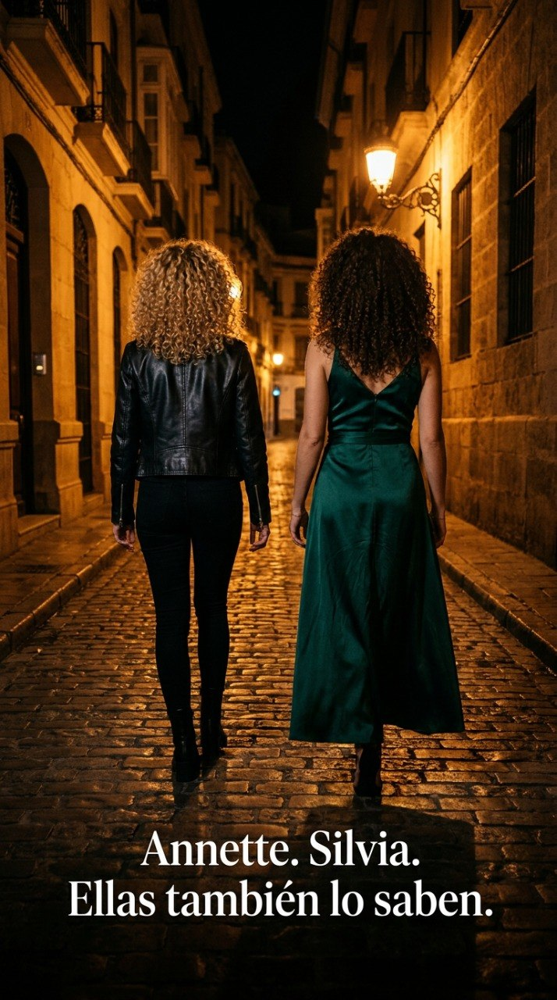
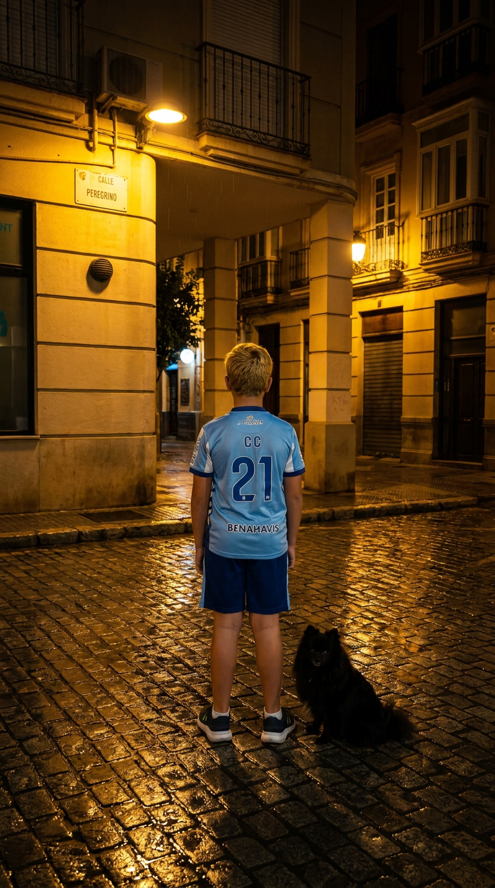

<!DOCTYPE html>
<html lang="es">
<head>
  <meta charset="UTF-8" />
  <meta name="viewport" content="width=device-width, initial-scale=1.0" />
  <title>PRIMERO LOVE YOU | Trilogía oficial</title>
  <meta name="description" content="Web oficial de PRIMERO LOVE YOU de Christian C. D'Rosoy. Capítulos gratuitos, galería, personajes, vídeo, reseñas y compra en Amazon y Málaga." />
  <meta name="author" content="Christian C. D'Rosoy" />
  <meta name="theme-color" content="#0b0b12" />
  <meta property="og:title" content="PRIMERO LOVE YOU | El hijo del mañana" />
  <meta property="og:description" content="Romance, ciencia ficción y suspenso emocional. Lee los primeros capítulos gratis." />
  <meta property="og:type" content="website" />
  <meta name="twitter:card" content="summary_large_image" />
  
  <link rel="preconnect" href="https://fonts.googleapis.com">
  <link rel="preconnect" href="https://fonts.gstatic.com" crossorigin>
  <link href="https://fonts.googleapis.com/css2?family=Inter:wght@400;500;600;700;800&display=swap" rel="stylesheet">
  
</head>
<body class="selection:bg-amber-300 selection:text-black">

  <header class="fixed top-0 left-0 right-0 z-50 border-b border-white/10 bg-[#09090f]/82 backdrop-blur-xl">
    

      <a href="#inicio" class="flex items-center gap-3 shrink-0">
        
✦

        

          
PRIMERO LOVE YOU

          
Trilogía oficial

        

      </a>
      <nav class="hidden lg:flex items-center gap-4 text-sm text-zinc-300">
        <a href="#autor" class="hover:text-white transition-colors">Autor</a>
        <a href="#sinopsis" class="hover:text-white transition-colors">Sinopsis</a>
        <a href="#novela" class="hover:text-white transition-colors">La novela</a>
        <a href="#leer" class="hover:text-white transition-colors">Leer gratis</a>
        <a href="#galeria" class="hover:text-white transition-colors">Galería</a>
        <a href="#personajes" class="hover:text-white transition-colors">Personajes</a>
        <a href="#video" class="hover:text-white transition-colors">Vídeo</a>
        <a href="#resenas" class="inline-flex items-center gap-1.5 rounded-full border border-white/15 bg-white/5 px-3 py-1.5 text-zinc-100 hover:bg-white/10 transition-colors">✦ Reseñas</a>
        <a href="#contacto" class="hover:text-white transition-colors">Contacto</a>
      </nav>
      

        <a href="https://www.amazon.es/dp/B0H12QX4HW" target="_blank" rel="noreferrer" class="hidden md:inline-flex items-center gap-2 rounded-full bg-gradient-to-r from-amber-300 to-amber-200 px-4 py-2 text-sm font-semibold text-black hover:from-amber-200 hover:to-amber-100 transition-colors">Comprar</a>
        <button id="menu-btn" class="lg:hidden w-10 h-10 rounded-full border border-white/15 bg-white/5 flex items-center justify-center text-white" onclick="document.getElementById('mobile-menu').classList.toggle('open')">☰</button>
      

    

    

      <a href="#autor" onclick="document.getElementById('mobile-menu').classList.remove('open')" class="hover:text-white">Autor</a>
      <a href="#sinopsis" onclick="document.getElementById('mobile-menu').classList.remove('open')" class="hover:text-white">Sinopsis</a>
      <a href="#novela" onclick="document.getElementById('mobile-menu').classList.remove('open')" class="hover:text-white">La novela</a>
      <a href="#leer" onclick="document.getElementById('mobile-menu').classList.remove('open')" class="hover:text-white">Leer gratis</a>
      <a href="#galeria" onclick="document.getElementById('mobile-menu').classList.remove('open')" class="hover:text-white">Galería</a>
      <a href="#personajes" onclick="document.getElementById('mobile-menu').classList.remove('open')" class="hover:text-white">Personajes</a>
      <a href="#video" onclick="document.getElementById('mobile-menu').classList.remove('open')" class="hover:text-white">Vídeo</a>
      <a href="#resenas" onclick="document.getElementById('mobile-menu').classList.remove('open')" class="hover:text-white">✦ Reseñas</a>
      <a href="#contacto" onclick="document.getElementById('mobile-menu').classList.remove('open')" class="hover:text-white">Contacto</a>
    

  </header>

  <main class="pt-16">
    <section id="inicio" class="relative min-h-[100svh] flex items-end">
      
      

      

        

          
Web oficial · Libro I · Experiencia cinematográfica

          <h1 class="text-4xl sm:text-5xl md:text-7xl font-semibold leading-[0.95] tracking-tight text-white">PRIMERO LOVE YOUEl hijo del mañana</h1>
          

            
«Echar de menos a alguien que no conoces es una forma de locura que no tiene diagnóstico.»

          

          

            <a href="#leer" class="inline-flex items-center justify-center gap-2 rounded-full bg-white px-6 py-3 font-semibold text-black hover:bg-zinc-100 transition-colors">Leer capítulos gratis</a>
            <a href="https://www.amazon.es/dp/B0H12QX4HW" target="_blank" rel="noreferrer" class="inline-flex items-center justify-center gap-2 rounded-full border border-white/20 bg-white/8 px-6 py-3 font-semibold text-white hover:bg-white/14 transition-colors">Comprar en Amazon</a>
          

        

      

    </section>

    <section id="autor" class="max-w-7xl mx-auto px-4 md:px-6 py-20 md:py-28">
      

        

        

          
Sobre el autor

          <h2 class="text-3xl md:text-5xl font-semibold text-white leading-tight">Christian C. D'Rosoy</h2>
          
Una voz narrativa con identidad propia, sensibilidad contemporánea y una forma de contar que mezcla emoción, tensión, misterio y mirada cinematográfica.

        

      

    </section>

    <section id="sinopsis" class="max-w-7xl mx-auto px-4 md:px-6 py-20 md:py-28 scroll-mt-24 relative">
      

        
Sinopsis

      

      

        <figure class="overflow-hidden rounded-[1.9rem] border border-white/10 bg-black/20 shadow-2xl shadow-black/25 ring">
          
          <figcaption class="px-5 py-4 text-sm tracking-wide uppercase text-amber-200/90 border-t border-white/10 bg-black/35">Málaga también es ficción</figcaption>
        </figure>
        <figure class="overflow-hidden rounded-[1.9rem] border border-white/10 bg-black/20 shadow-2xl shadow-black/25 ring">
          
          <figcaption class="px-5 py-4 text-sm tracking-wide uppercase text-amber-200/90 border-t border-white/10 bg-black/35">¿Quién es CC2?</figcaption>
        </figure>
      

      

        

          
¿Qué harías si un niño desconocido te abrazara llorando... y te llamara papá?

          
¿Y si supiera cosas sobre tu vida que todavía no han ocurrido?

          
¿Y si el amor de tu vida ya hubiera vivido esta historia antes que tú?

        

      

    </section>

    <section id="novela" class="border-y border-white/10 bg-white/[0.03]">
      

        

        

          
La novela

          <h2 class="text-3xl md:text-5xl font-semibold text-white leading-tight">Libro I — El hijo del mañana</h2>
          
¿Qué harías si un niño apareciera en tu vida asegurando ser tu hijo… y lo más aterrador fuera descubrir que dice la verdad?

        

      

    </section>

    <section id="leer" class="max-w-7xl mx-auto px-4 md:px-6 py-20 md:py-28">
      
Leer gratis

      <h2 class="text-3xl md:text-5xl font-semibold text-white leading-tight">Dedicatoria, prólogo y capítulos 1 al 6</h2>
      
Formato editorial completo. Lee los primeros capítulos de la novela directamente aquí.

      

        <article id="prologo" class="scroll-mt-24 rounded-[2rem] overflow-hidden border border-white/10 ring">
          

            Prólogo
            <h3 class="mt-3 text-2xl md:text-3xl font-semibold text-white">Prólogo</h3>
          

          

            

              
«Echar de menos a alguien que no conoces es una forma de locura que no tiene diagnóstico». —CC

              
Hay ausencias que no dejan fotografías. No tienen fecha ni entierro. Y, sin embargo, pesan más que los muertos con nombre.

            

          

        </article>

        <article id="cap1" class="scroll-mt-24 rounded-[2rem] overflow-hidden border border-white/10 ring">
          

            Capítulo 1
            <h3 class="mt-3 text-2xl md:text-3xl font-semibold text-white">Todavía no ha pasado</h3>
            
Lunes · 08:15 h · Calle La Unión · Málaga · 2026

          

          

            

              
Hay exactamente dos momentos en la vida de todo hombre en los que el tiempo se detiene de verdad: cuando alguien te dice que vas a ser padre y cuando te lo reclama un niño al que nunca has visto.

            

          

        </article>
      

    </section>

    <section id="galeria" class="border-y border-white/10 bg-white/[0.03]">
      

        
Galería

        <h2 class="text-3xl md:text-5xl font-semibold text-white leading-tight">Presentación del libro</h2>
        

          
          
          
          
          
          
          
        

      

    </section>

    <section id="personajes" class="max-w-7xl mx-auto px-4 md:px-6 py-20 md:py-28">
      
Personajes

      <h2 class="text-3xl md:text-5xl font-semibold text-white leading-tight">Así podría verse el universo humano de la novela</h2>
      

        
        
        
        
        
        
        
        
        
        
        
        
        
      

    </section>

    <section id="video" class="border-y border-white/10 bg-white/[0.03]">
      

        
Vídeo

        <h2 class="text-3xl md:text-5xl font-semibold text-white leading-tight">Booktrailer / presentación</h2>
        

          

            <iframe class="w-full h-full" src="https://www.youtube.com/embed/ADlNpdwBY0o" title="Vídeo PRIMERO LOVE YOU" loading="lazy" allow="accelerometer; autoplay; clipboard-write; encrypted-media; gyroscope; picture-in-picture; web-share" referrerpolicy="strict-origin-when-cross-origin" allowfullscreen></iframe>
          

        

      

    </section>

    <section id="comprar" class="max-w-7xl mx-auto px-4 md:px-6 py-20 md:py-28">
      

        

          
Opiniones de lectores

          <h2 class="text-3xl md:text-5xl font-semibold text-white leading-tight">Lo que dicen quienes lo han leído</h2>
          
Reseñas verificadas de Amazon.

        

        <aside class="rounded-[2rem] border border-white/10 bg-gradient-to-b from-white/6 to-white/[0.03] p-6 md:p-8 h-fit ring">
          
Compra física en Málaga

          <h3 class="mt-4 flex items-center gap-2 text-2xl font-semibold text-white">Librerías Proteo Prometeo</h3>
          
Tu ejemplar también puede comprarse físicamente en uno de los puntos libreros más reconocidos de Málaga.

        </aside>
      

    </section>

    <section id="contacto" class="border-t border-white/10 bg-black/20">
      

        
Contacto y redes

        <h2 class="text-3xl md:text-5xl font-semibold text-white leading-tight">Christian C. D'Rosoy</h2>
        
Correo y redes sociales oficiales del proyecto.

        

          <a href="mailto:christiancdrosoy@hotmail.com" class="inline-flex items-center gap-2 rounded-full border border-white/15 px-4 py-2 text-sm text-white hover:bg-white/8 transition-colors">✉ Correo</a>
          <a href="https://www.instagram.com/primeroloveyou_libro?igsh=YTJhOWJ6M2Fkc2Ru&utm_source=qr" target="_blank" rel="noreferrer" class="inline-flex items-center gap-2 rounded-full border border-white/15 px-4 py-2 text-sm text-white hover:bg-white/8 transition-colors">Instagram</a>
          <a href="https://www.facebook.com/share/g/163orYLTEDm/?mibextid=wwXIfr" target="_blank" rel="noreferrer" class="inline-flex items-center gap-2 rounded-full border border-white/15 px-4 py-2 text-sm text-white hover:bg-white/8 transition-colors">Facebook</a>
          <a href="https://www.tiktok.com/@primeroloveyou_libro?_r=1&_t=ZN-97yLDwzYbXn" target="_blank" rel="noreferrer" class="inline-flex items-center gap-2 rounded-full border border-white/15 px-4 py-2 text-sm text-white hover:bg-white/8 transition-colors">TikTok</a>
          <a href="https://youtube.com/shorts/ADlNpdwBY0o" target="_blank" rel="noreferrer" class="inline-flex items-center gap-2 rounded-full border border-white/15 px-4 py-2 text-sm text-white hover:bg-white/8 transition-colors">YouTube</a>
        

        

          

            
© 2026 Christian C. D'Rosoy

            
PRIMERO LOVE YOU · Libro I · Trilogía oficial · Ediciones 52.1 · Málaga, España

          

          <a href="#inicio" class="inline-flex items-center gap-2 rounded-full border border-white/15 px-4 py-2 text-sm text-white hover:bg-white/8 transition-colors">↑ Volver arriba</a>
        

      

    </section>
  </main>
</body>
</html>
